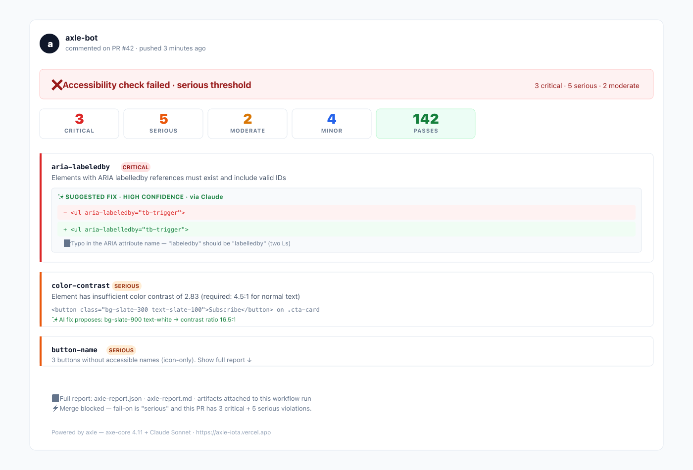
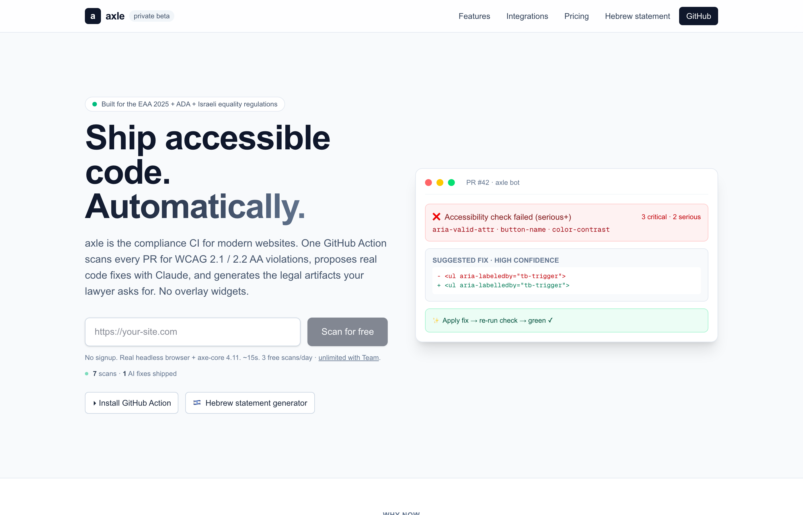
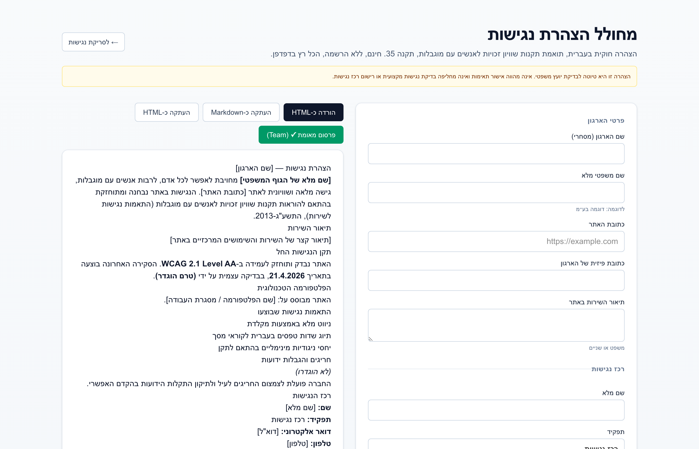

# axle — a11y / WCAG Accessibility CI

[](https://github.com/marketplace/actions/axle-accessibility-compliance-ci)
[](https://github.com/asafamos/axle-action/releases)
[](LICENSE)
[](https://axle-iota.vercel.app?utm_source=axle-action-repo)

**a11y / WCAG 2.2 AA accessibility CI for GitHub.** Scan every pull request for WCAG 2.1 / 2.2 AA violations and block merges when accessibility regresses. Real source-code fix suggestions via Claude. No overlay widgets.

Built for teams under **EAA 2025**, **ADA Title III**, **Section 508**, and **Israeli תקנה 35** enforcement. Runs on `ubuntu-24.04` in ~90 seconds including browser install on a warm cache.

**Keywords**: a11y, accessibility, WCAG, WCAG 2.2, axe-core, EAA, EAA 2025, ADA, Section 508, EN 301 549, accessibility CI, a11y testing, PR accessibility check, automated accessibility.

```yaml
- uses: asafamos/axle-action@v1
  with:
    url: https://preview-${{ github.event.pull_request.number }}.mydomain.dev
    fail-on: serious
    with-ai-fixes: "true"
    anthropic-api-key: ${{ secrets.ANTHROPIC_API_KEY }}
```

That's it. You get a sticky PR comment with every violation grouped by severity, a downloadable JSON + markdown report artifact, and a non-zero exit code if violations cross the `fail-on` threshold.

---


## What you get in every PR



axle posts (and keeps updating) one comment on every PR — severity breakdown at the top, one card per failing rule, and when `with-ai-fixes: "true"` is set, Claude-generated source-code diffs appear inline in the same comment. Merge gets blocked when violations meet or exceed your `fail-on` threshold.

## Same engine in every pipeline

axle ships as a GitHub Action (here), an [npm CLI](https://www.npmjs.com/package/axle-cli), and plugins for [Netlify](https://www.npmjs.com/package/axle-netlify-plugin), [Cloudflare Pages](https://www.npmjs.com/package/axle-cloudflare-plugin), [Vercel](https://www.npmjs.com/package/axle-vercel-plugin), and [WordPress](https://github.com/asafamos/axle/tree/main/packages/axle-wordpress). All use the same axe-core 4.11 engine and the same Claude prompt — so your scan output is identical whether it runs in CI or in your local admin.



## Hebrew accessibility statement (free)

axle includes a free [Israeli תקנה 35 / EAA statement generator](https://axle-iota.vercel.app/statement) that runs locally in your browser. Published verified statement URLs (`axle-iota.vercel.app/s/<id>`) — the tamper-evident artifact your compliance officer hands a regulator — are on the paid Team plan.



## Why axle

- **No runtime overlay.** Overlay widgets (the "robot button") cost accessiBe a $1M FTC fine in January 2025 for deceptive practices. axle never injects JavaScript into your production page — it scans, suggests source-code diffs, and lets your merge button decide.
- **Fix, not just detect.** Most a11y tools stop at "here's what's wrong." axle sends every serious+ violation through Claude Sonnet and proposes a surgical diff: `- <ul aria-labeledby="trigger">` → `+ <ul aria-labelledby="trigger">`. High-confidence diffs go straight into the PR comment.
- **Runs where you already deploy.** Same engine as the [npm CLI](https://www.npmjs.com/package/axle-cli), [Netlify plugin](https://www.npmjs.com/package/axle-netlify-plugin), [Cloudflare Pages plugin](https://www.npmjs.com/package/axle-cloudflare-plugin), and [Vercel plugin](https://www.npmjs.com/package/axle-vercel-plugin). Pick the pipeline you have.

---

## Quick-start patterns

### Scan an already-deployed preview URL

```yaml
# .github/workflows/accessibility.yml
name: Accessibility
on: pull_request

permissions:
  contents: read
  pull-requests: write

jobs:
  axle:
    runs-on: ubuntu-24.04
    steps:
      - uses: actions/checkout@v4
      - uses: asafamos/axle-action@v1
        with:
          url: https://preview-${{ github.event.pull_request.number }}.mydomain.dev
          fail-on: serious
```

### Build + start your project locally, then scan

Leave `url` empty and the Action will run `install-command` → `build-command` → `start-command` and scan `http://localhost:<wait-on-port>`. Defaults are `npm ci` / `npm run build` / `npm start` / `3000`.

```yaml
- uses: asafamos/axle-action@v1
  with:
    fail-on: serious
    install-command: npm ci
    build-command: npm run build
    start-command: npm start
    wait-on-port: "3000"
```

### With AI fix suggestions

```yaml
- uses: asafamos/axle-action@v1
  with:
    url: https://staging.example.com
    fail-on: serious
    with-ai-fixes: "true"
    max-ai-fixes: "15"
    anthropic-api-key: ${{ secrets.ANTHROPIC_API_KEY }}
```

Caps AI calls at `max-ai-fixes` per run so you don't get a surprise bill. Diffs appear in the PR comment right below the failing rule.

### Report only — don't fail the build

```yaml
- uses: asafamos/axle-action@v1
  with:
    url: https://staging.example.com
    fail-on: none
    comment-on-pr: "true"
```

Useful for migrating existing projects that are already in violation — get visibility first, then tighten.

---

## Inputs

| Input | Default | Notes |
|---|---|---|
| `url` | _(empty)_ | URL to scan. Empty = build + start your Node project on `localhost:<wait-on-port>`. |
| `fail-on` | `serious` | `critical` / `serious` / `moderate` / `minor` / `none` |
| `with-ai-fixes` | `"false"` | If `"true"`, Claude proposes a diff per violation (requires `anthropic-api-key`). |
| `max-ai-fixes` | `10` | Upper bound on AI calls per run (cost guard). |
| `anthropic-api-key` | — | Store as a repo secret. Required only if `with-ai-fixes: "true"`. |
| `anthropic-model` | `claude-sonnet-4-6` | Any Claude model ID the SDK supports. |
| `comment-on-pr` | `"true"` | Set `"false"` to run silently. |
| `github-token` | `github.token` | Needs `pull-requests: write` to comment. |
| `install-command` | `npm ci` | Used only when `url` is empty. |
| `build-command` | `npm run build` | Used only when `url` is empty. |
| `start-command` | `npm start` | Used only when `url` is empty. |
| `wait-on-port` | `3000` | Port the local server binds to. |

## Outputs

| Output | Example | Notes |
|---|---|---|
| `json-path` | `/github/workspace/axle-report.json` | Full machine-readable report. |
| `markdown-path` | `/github/workspace/axle-report.md` | Human-readable report (same text as PR comment). |
| `failing` | `"true"` / `"false"` | Whether violations met or exceeded `fail-on`. |

---

## FAQ

**Q: Do I need an Anthropic API key?**
No — scanning is free without one. You only need a key if you want Claude-generated code-fix diffs (`with-ai-fixes: "true"`).

**Q: Does this replace a professional accessibility audit?**
No. Automated tools (including axe-core 4.11, the engine here) catch ~57% of WCAG issues. This is the fast, continuous, cheap layer. Pair it with a human auditor for the remaining 43%.

**Q: Why does it rebuild Chromium on the first run?**
Playwright needs the exact Chromium the axe-core integration is tested against. The Action caches it via `actions/cache` — warm runs take ~30s, cold first runs ~120s.

**Q: Do you store my code or scan results?**
No. The scan runs on the GitHub runner. Only an anonymous `source=axle-action` ping is sent to track ecosystem usage — no URLs, no content, no identifiers. Disable by setting `AXLE_NO_TELEMETRY=1`.

**Q: Can I use this outside of GitHub Actions?**
Yes — same scanner ships as [`axle-cli`](https://www.npmjs.com/package/axle-cli) for any CI or cron, plus plugins for [Netlify](https://www.npmjs.com/package/axle-netlify-plugin), [Cloudflare Pages](https://www.npmjs.com/package/axle-cloudflare-plugin), and [Vercel](https://www.npmjs.com/package/axle-vercel-plugin).

---

## Compliance context

- **EAA 2025** — The European Accessibility Act is enforceable as of **28 June 2025**. Penalties up to 4% of global revenue in some member states.
- **ADA** — U.S. courts apply WCAG 2.1 AA as the de facto standard. Demand-letter traffic grew 320% in 2023-2024.
- **Israeli תקנה 35** — Updated October 2024 with stricter enforcement. Hebrew [accessibility statement generator](https://axle-iota.vercel.app/statement?utm_source=axle-action-readme) is free and runs locally in your browser.

## Not a compliance certificate

axle provides remediation assistance. It is not a substitute for legal advice or a full human accessibility audit. Automated tools catch a majority — but not all — WCAG violations.

---

Learn more: [axle-iota.vercel.app](https://axle-iota.vercel.app?utm_source=axle-action-repo) · [Changelog](https://axle-iota.vercel.app/changelog?utm_source=axle-action-readme) · [Pricing](https://axle-iota.vercel.app/#pricing?utm_source=axle-action-readme)

## Privacy

This Action contacts Chainguard's licensing server to verify authorization. Connection metadata (IP address, GitHub repository identifier, timestamp, and any metadata encoded in the auth token) is transmitted to Chainguard, Inc. even if authorization is denied in accordance with our [Privacy Notice](https://www.chainguard.dev/legal/privacy-notice)
